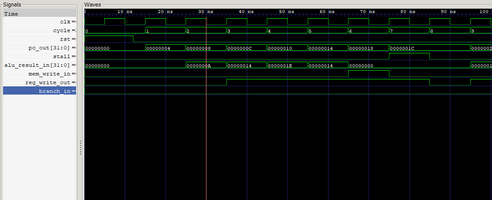

# 5-Stage Pipelined RISC Processor (Verilog)

A classic MIPS-style 5-stage pipelined CPU implemented in Verilog.

## Pipeline Stages
IF -> ID -> EX -> MEM -> WB

## Supported Instructions
- R-type: `add`, `sub`, `and`, `or`, `slt` (opcode 000000, distinguished by funct field)
- `addi rt, rs, imm`  (opcode 001000)
- `lw   rt, imm(rs)`  (opcode 100011)
- `sw   rt, imm(rs)`  (opcode 101011)
- `beq  rs, rt, imm`  (opcode 000100)
- `j    target`       (opcode 000010)

## Hazard Handling
- **Forwarding unit**: forwards ALU results from EX/MEM and MEM/WB stages
  back into the EX stage to resolve RAW hazards without stalling.
- **Hazard detection unit**: detects load-use hazards (a load followed
  immediately by an instruction that needs the loaded value) and stalls
  the pipeline for one cycle by freezing PC/IF-ID and inserting a bubble
  into ID/EX.
- **Branch handling**: branches (`beq`) are resolved in the EX stage.
  If taken, the two instructions fetched after the branch (in IF and
  IF/ID) are flushed (converted to NOPs).
- **Jumps**: resolved in ID stage (no register dependency), flushing the
  next fetched instruction.

## File List
| File | Description |
|---|---|
| `defines.v` | Opcode/funct/ALU control constants |
| `pc.v` | Program counter register |
| `instr_mem.v` | Instruction memory (loads `program.hex`) |
| `reg_file.v` | 32x32-bit register file |
| `alu.v` | ALU |
| `alu_control.v` | ALU control decoder |
| `control_unit.v` | Main control unit (ID stage) |
| `hazard_unit.v` | Load-use hazard detection |
| `forwarding_unit.v` | EX-stage operand forwarding |
| `data_mem.v` | Data memory |
| `if_id_reg.v` | IF/ID pipeline register |
| `id_ex_reg.v` | ID/EX pipeline register |
| `ex_mem_reg.v` | EX/MEM pipeline register |
| `mem_wb_reg.v` | MEM/WB pipeline register |
| `pipeline_cpu.v` | Top-level module wiring all stages together |
| `program.hex` | Sample machine-code program (hex, one instr/line) |
| `tb_pipeline_cpu.v` | Testbench with cycle trace and result checks |

## Sample Program (`program.hex`)
```
addi r1, r0, 10        # r1 = 10
addi r2, r0, 20        # r2 = 20
add  r3, r1, r2        # r3 = 30   (tests forwarding)
sub  r4, r3, r1        # r4 = 20   (tests EX/MEM forwarding)
sw   r4, 0(r0)         # mem[0] = 20
lw   r5, 0(r0)         # r5 = 20   (load)
add  r6, r5, r1        # r6 = 30   (load-use hazard -> stall)
beq  r1, r1, 2         # branch taken, skip next 2 instrs
addi r7, r0, 99        # skipped
addi r8, r0, 99        # skipped
addi r9, r0, 7         # r9 = 7
and  r10, r9, r1       # r10 = 2
or   r11, r9, r1       # r11 = 15
slt  r12, r1, r2       # r12 = 1
```

## Verified Output

Tested on Windows with Icarus Verilog v12. Running the testbench against
`program.hex` above produces:

```
--- Final Register File State ---
r1  = 10 (expect 10)
r2  = 20 (expect 20)
r3  = 30 (expect 30)
r4  = 20 (expect 20)
r5  = 20 (expect 20)
r6  = 30 (expect 30)
r7  = 0 (expect 0, branch skipped)
r8  = 0 (expect 0, branch skipped)
r9  = 7 (expect 7)
r10 = 2 (expect 2)
r11 = 15 (expect 15)
r12 = 1 (expect 1)
mem[0] = 20 (expect 20)
```

All values match expected results, confirming correct operation of
forwarding (r3, r4), the load-use stall (r6), the branch flush (r7, r8),
and standard ALU/memory ops (r9-r12, mem[0]).

> **Note:** an earlier version had a same-cycle register file
> read/write hazard bug (a register written in WB and read in ID in
> the same cycle returned the stale value). This was fixed in
> `reg_file.v` by adding internal write-forwarding to the read ports.

## Additional Test Programs (`test_programs/`)

To run `instr_mem.v` against a different program, copy the desired file to
`program.hex` (or edit the `$readmemh` path in `instr_mem.v`), then
recompile/run.

- `program_main.hex` — the primary forwarding/hazard/branch test described above.
- `program_sum.hex` — sums 1+2+3+4+5 using repeated `addi`/`add` (tests
  back-to-back RAW forwarding on every instruction). Expect final `r1 = 15`.
- `program_branch.hex` — tests both a taken `beq` (skips one instruction)
  and a not-taken `beq` (falls through normally). Expect final
  `r4 = 0` (skipped), `r5 = 11`, `r6 = 22`.

## How to Run a Different Test Program
```bash
cp test_programs/program_sum.hex program.hex
vvp sim.out
```

## How to Simulate (Icarus Verilog)
```bash
iverilog -o sim.out \
  defines.v pc.v instr_mem.v reg_file.v alu.v alu_control.v \
  control_unit.v hazard_unit.v forwarding_unit.v data_mem.v \
  if_id_reg.v id_ex_reg.v ex_mem_reg.v mem_wb_reg.v \
  pipeline_cpu.v tb_pipeline_cpu.v

vvp sim.out
```

Make sure `program.hex` is in the same directory as the simulation binary
(the instruction memory reads it via `$readmemh`).

Expected final register values are printed by the testbench, e.g.:
```
r1  = 10
r2  = 20
r3  = 30
r4  = 20
r5  = 20
r6  = 30
r7  = 0
r8  = 0
r9  = 7
r10 = 2
r11 = 15
r12 = 1
mem[0] = 20
```

## Waveform



Key signals visible:
- **pc_out** — PC incrementing every cycle (0x00, 0x04, 0x08...)
- **stall** — goes high for one cycle during the load-use hazard
- **alu_result_in** — ALU output: 0xA(10), 0x14(20), 0x1E(30), 0x14(20)...
- **mem_write_in** — pulses high during the `sw` instruction
- **reg_write_out** — toggles as instructions write back to the register file

## Viewing Waveforms (GTKWave)

To generate and view signal waveforms cycle-by-cycle:

**1. Add these two lines to `tb_pipeline_cpu.v`** inside the first `initial` block, before `#400`:

```verilog
initial begin
    $dumpfile("wave.vcd");
    $dumpvars(0, tb_pipeline_cpu);
    #400;
    ...
end
```

**2. Recompile and run:**

```bash
iverilog -o sim.out defines.v pc.v instr_mem.v reg_file.v alu.v alu_control.v \
  control_unit.v hazard_unit.v forwarding_unit.v data_mem.v \
  if_id_reg.v id_ex_reg.v ex_mem_reg.v mem_wb_reg.v \
  pipeline_cpu.v tb_pipeline_cpu.v
vvp sim.out
```

This generates `wave.vcd` in the same folder.

**3. Open in GTKWave:**

```bash
gtkwave wave.vcd
```

**4. Useful signals to add in GTKWave:**

Expand `tb_pipeline_cpu > DUT` in the left panel and drag these into the waveform view:

| Signal | What it shows |
|---|---|
| `pc_current` | PC advancing each cycle |
| `instr_if` | Raw instruction being fetched |
| `ex_alu_result` | ALU output in EX stage |
| `hazard_stall` | Goes high during load-use stall |
| `branch_taken` | Pulses when BEQ is taken |
| `wb_reg_write` | Register file write enable |
| `exmem_mem_write` | Goes high during SW instruction |

You can clearly see the **load-use stall** (one cycle where `hazard_stall=1` and PC freezes), the **branch flush** (`branch_taken=1` followed by two NOP cycles), and **forwarding** keeping the pipeline moving without extra stalls.

## Pushing to GitHub

```bash
cd riscv_pipeline
git init
git add .
git commit -m "5-stage pipelined RISC processor with hazard handling"
git branch -M main
git remote add origin https://github.com/<your-username>/<repo-name>.git
git push -u origin main
```

## License
MIT — see `LICENSE`.

## Notes / Possible Extensions
- Currently single-cycle data memory; could add a memory stall path.
- Branches resolved in EX (1-cycle penalty if taken, 2 instr flushed).
  Could move to ID stage with early comparator for a 1-instr penalty.
- No exception/interrupt handling.
- Could add a static/dynamic branch predictor to reduce branch penalty.
